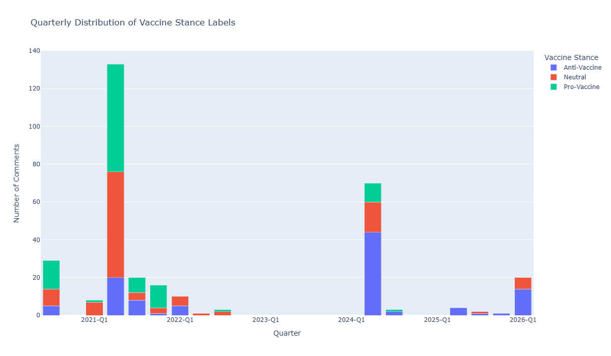
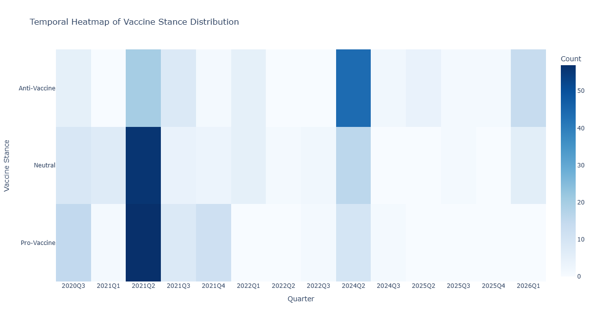

# Multilingual Vaccine Hesitancy Detection

## Overview

This project investigates vaccine hesitancy detection in multilingual social media comments using traditional machine learning, deep learning, and transformer-based approaches.

The dataset consists of English, Hindi, and code-mixed YouTube comments manually annotated into three classes:

* Pro-Vaccine
* Anti-Vaccine
* Neutral

---

## Models Implemented

* TF-IDF + LinearSVC
* Convolutional Neural Network (CNN)
* Multilingual BERT (mBERT)

---

## Dataset

* Approximately 3,500 collected YouTube comments
* 320 manually labelled comments
* English, Hindi, and English-Hindi code-mixed content

---

## Results

| Model              | Accuracy | Macro F1 |
| ------------------ | -------- | -------- |
| TF-IDF + LinearSVC | 56.25%   | 54.92%   |
| CNN                | 65.62%   | 62.19%   |
| mBERT              | 57.81%   | 57.59%   |

---

## Key Findings

* CNN achieved the best overall performance on the manually labelled dataset.
* Preserving multilingual characters improved classification quality.
* Transformer models did not outperform simpler architectures under limited training data.
* Temporal analysis revealed event-driven vaccine discussions.
* Manual annotation produced more balanced and realistic stance distributions than GPT-assisted labelling.

---

## Temporal Analysis

### Quarterly Distribution of Vaccine Stance Labels

### Temporal Heatmap of Vaccine Stance Distribution

---

## Technologies Used

* Python
* Pandas
* NumPy
* Scikit-learn
* PyTorch
* Hugging Face Transformers
* Plotly
* NLP

---

## Future Work

* Larger annotated datasets
* Semi-supervised learning
* XLM-RoBERTa and IndicBERT
* Context-aware stance classification
* Multimodal misinformation detection
